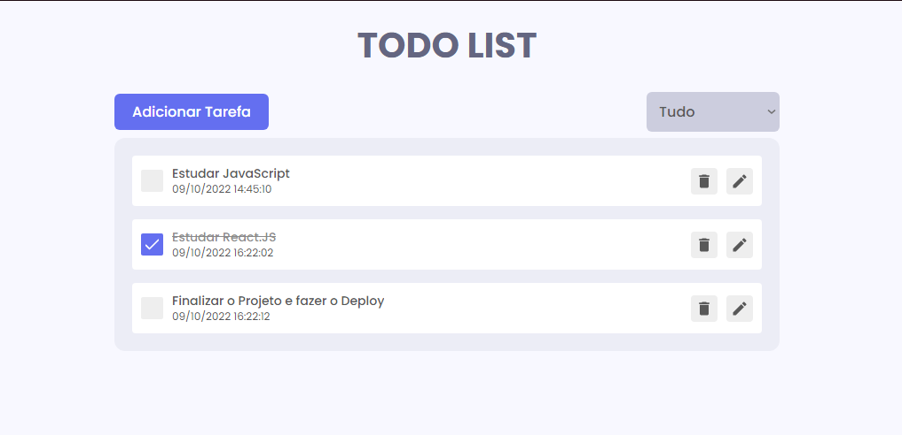

# Todo-List

TodoList completa e interativa.

### Desenvolvido e Otimizado por: [Lucas Mariano dos Santos](https://www.linkedin.com/in/lucas-mariano-846312107/)

## Descrição do Projeto

Nesse projeto, desenvolvi um 'TodoList' inteiramente feito em React.JS, com opções de adicionar tarefas, acompanhá-las, podendo posteriormente editá-las ou excluí-las, além de poder filtrar as mesmas em Tudo | Incompletas | Completas (As tarefas já são filtradas automaticamente por Data e Horário).

## Frameworks e Ferramentas Utilizadas:

- [React](https://reactjs.org/)
- [React Redux](https://redux.js.org/)
- [Framer Motion](https://framer.com/motion/)
- [React icons](https://react-icons.netlify.com/)
- [React Hot Toast](https://react-hot-toast.com/)
- [Flaticon.com](https://www.flaticon.com/)
- [VS Code](https://code.visualstudio.com/)

## Para Executar o Projeto

Para Executar o Projeto, Disponibilizei um guia abaixo.

Após baixar os arquivos, vá ao local dos mesmos e execute o comando no Terminal

```shell
npm install
```

Após instalar, execute o comando abaixo para iniciar a aplicação.

```shell
npm start
```
